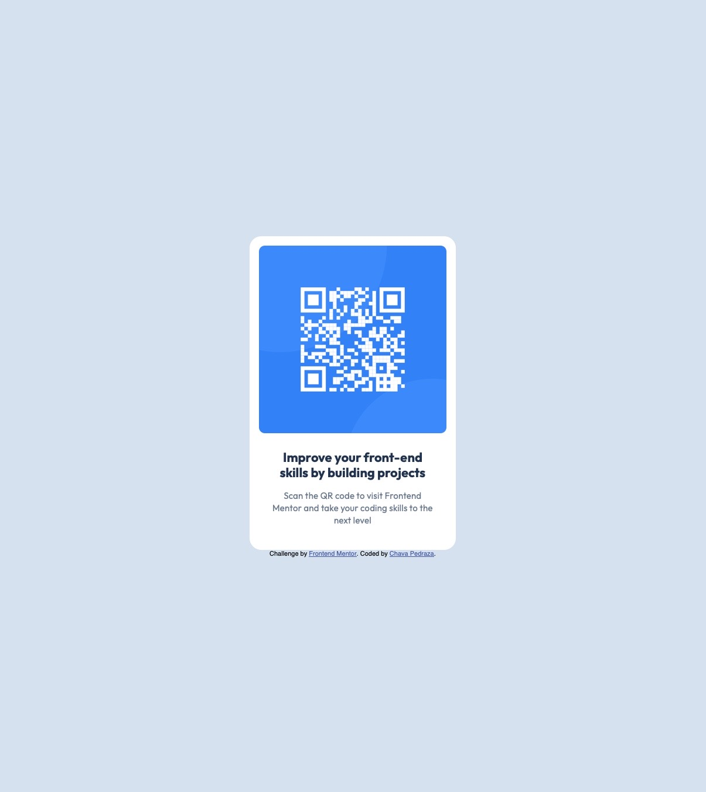

# Frontend Mentor - QR code component solution

This is a solution to the [QR code component challenge on Frontend Mentor](https://www.frontendmentor.io/challenges/qr-code-component-iux_sIO_H). Frontend Mentor challenges help you improve your coding skills by building realistic projects. 

## Table of contents

- [Overview](#overview)
  - [Screenshot](#screenshot)
  - [Links](#links)
- [My process](#my-process)
  - [Built with](#built-with)
  - [What I learned](#what-i-learned)
  - [Continued development](#continued-development)
  - [Useful resources](#useful-resources)
- [Author](#author)

## Overview

### Screenshot



### Links

- Solution URL: [Add solution URL here](https://github.com/Chavakn0/fem-ch1)
- Live Site URL: [Add live site URL here](https://chavakn0.github.io/fem-ch1/)

## My process

### Built with

- Semantic HTML5 markup
- CSS custom properties
- Flexbox

### What I learned

Got to use flexbox and change the direction from horizontal to vertical, which shows that you don't need to go crazy with the code, there're simple solutions fro simple problems:

```html
body {
      margin: 0;
      height: 100vh;
      display: flex;
      flex-direction: column;
      justify-content: center;
      align-items: center;
      background-color: #d5e1ef;
      font-family: sans-serif;
    }
```

This is the best example of the Cascade part in CSS, or in other way the specificity of code.
I have a .container class, followed by a .subcontainer class, after that a .subcontainer p, and finally a .subcontainer p:first-of-type, which let me style evrything on its own according to what they need, and this more specific one to have some characteristics that I needed just there:

```css
.subcontainer p:first-of-type {
      font-family: "Outfit", sans-serif;
      font-size: 22px;
      font-weight: 700;
      font-style: normal;
      letter-spacing: 0px;
      line-height: 120%;
      color: #1f314f;
      margin-top: 0px;
      margin-bottom: 16px;
    }
```

### Continued development

I want to better grasp what's the MVP in a website, what it's the most basic things that must be there always.
Also to understand and follow an inclusive and multi-platform focus for building sites.
And to practice and use more HTML, and CSS functions to broaden my understanding of web development.

### Useful resources

- [Web.dev](https://web.dev/) - Helped understand concepts of both HTML and CSS.
- [W3](https://www.w3schools.com/) - Just like Web.dev but more direct.
- [ChatGPT](https://chatgpt.com/) - This helped me when I was having trouble finding something specific.


## Author

- Website - [Chava Pedraza](https://github.com/Chavakn0/)
- Frontend Mentor - [@Chavakn0](https://www.frontendmentor.io/profile/Chavakn0)
